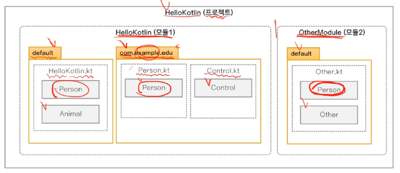
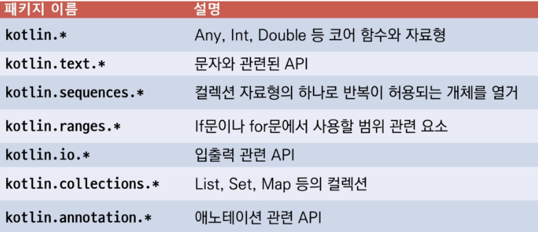

# Chpater2 : 변수와 자료형, 연산자

## 2.1 코틀린 패키지

### 프로젝트와 모듈, 패키지, 파일의 관계

- 프로젝트와 패키지(자바와 비슷)  

프로젝트 내부에는 여러 모듈이 있음, 모듈 내부는 여러 패키지가 있음, 패키지 내부에는 kt파일이 있음, kt파일에는 여러 class가 있음  
패키지명을 정하지 않으면 default 패키지 생성  
(패키지 이름을 그림과 같이 주소를 거꾸로 하는 형태로 짓는 이유는 다른 회사와 충돌하지 않게 하기 위해서)  

- 패키지 정의
    - 자바 프로젝트 처럼 디렉터리와 매치되어야 하지는 않는다.
    ```kotlin
    package con.example.edu
    class Person(val name: String, val age: Int)
    ```
    - 패키지를 지정하지 않으면 이름이 없는 기본(default) 패키지에 속한다.
    - import의 이름이 충돌하면 as 키워드로 로컬에서 사용할 이름을 변경해서 충돌을 피할 수 있다.
    ```kotlin
    import con.example.edu.Person
    import con,example.edu.Person as User // com.example.edu.Person을 User로 지정
    ```
    - import는 클래스 뿐만 아니라 다른 것도 임포트 할 수 있다.
        - 최상위 레벨 함수와 프로퍼티, 오브젝트 선언의 함수와 프로퍼티, 열거형 상수

(파일에 클래스가 하나 있고 그것의 이름이 파일과 같다면 확장자가 생략됨)

- 기본 패키지(코틀린 표준 라이브러리)
    - kotlin-stdlib-source.jar  
    


## 2.2 변수와 자료형

- Int, Short, Long
- UInt, UShort, ULong
- String
- Float, Double
- Boolean
- Char
- Number

- val(value) - 불변형
- var(variable) - 가변형

키워드 변수이름: 자료형 = 값  
val username: String = "Kildong"  

예제
- val username = "Kildong" //o 자료형을 추론하여 String으로 결정
- val username //x 자료형을 지정하지 않은 변수는 사용할 수 없다
- val init: Int //x 사용전 혹은 생성자 시점에서 init변수를 초기화 해야함
- val number = 10 //o number 변수는 Int형으로 추론

- 기본형(Primitive data type)
    - 가공되지 않은 순수한 자료형으로 프로그래밍 언어에 내장
    - int, long, float, double
- 참조형 (Reference type)
    - 동적 공간에 데이터를 둔 다음 이것을 참조하는 자료형
    - Int, Long, Float, Double
- 코틀린은 기본형 사용불가
- 컴파일러가 자동으로 최적화하여 JVM상에서는 기본형 사용됨

- 자료형 생략
    - val num1 = 127 // Int로 추론
    - val num2 = 92233720368547750827 // Long형으로 추론
- 접미사 접두사 사용
    - val exp1 = 123L // Long
    - 0x로 16진 0b로 2진
- 큰 수를 읽기 쉽게 _ 사용
    - val num = 1_000_000
- 공간 제약에 따른 부동 소수점 연산의 단점
    - var num: Double = 0.1 // binary -> 0.0001100110011~~| 무한대로 있지만 공간의 제약때문에 끊김
    - for(x in 0..999) {
        num += 0.1
      }
    - println(num) // 100.0999999999859
- 문자열
    - String으로 선언하며 String Pool이라는 공간에 구성
    - 표현식
        - val a=1
        - var s1 = "a is $a" //String 자료형의 s1을 선언하고 초기화 변수 a가 사용됨        

## 2.3 자료형 검사와 변환

- null을 허용한 변수 검사
    - NPE(NullPointerException) : 사용할 수 없는 null인 변수에 접근하면서 발생하는 예외
- 코틀린의 변수 선언은 기본적으로 null을 허용하지 않는다
    - val a: Int = 30
    - var b: String = "Hello"
- null 가능한 선언
    - val a: Int? = null
    - var b: String? = null
- 세이프콜
    - str1?.length //널이 아닌 경우만 접근해라
    - str1!!.length //널이 아니라고 단정함 -> 그런데 실제론 null인경우 NPE 발생
- 엘비스 연산자 (?:)
    - str1?.length ?: -1
    - "str1: $str1 length: ${str1?.length ?: -1}"
- 자료형 변환
    - 기본형을 사용하지 않고 참조형만 사용
    - 서로 다른 자료형은 변환 과정을 거친 후 비교
        - val a Int = 1
        - val b Double = a // error
    - 변환 메서드 이용
        - val b: Double = a.toDouble
    - 표현식에서 자료형의 자동 변환
        - val result = 1L + 3 // Long + Int -> Long
- 기본형과 참조형 자료형의 비교 원리
    - 이중 등호와 삼중 등호의 사용
        - == 값만 비교하는 경우
        - === 값과 참조 주소를 비교할 때
- 코틀린에서는 참조형으로 선언한 변수의 값이 -128~127범위에 있으면 그 값을 캐시에 저장함 그래서 다른 객체더라도 ===가 true로 나올 수 있음
- is 키워드를 사용한 검사
    if (num is Int)
    else if (num !is Int)
- Any
    - 자료형이 정해지지 않은 경우
    - 모든 클래스의 뿌리 - Int나 String은 Any형의 자식 클래스이다
    - Any는 언제든 필요한 자료형으로 자동 변환(스마트 캐스트)


## 2.4 코틀린 연산자

